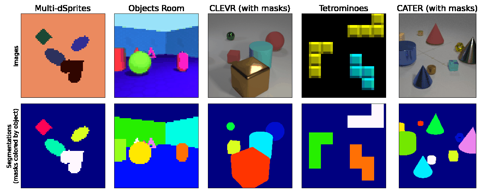

# Multi-Object Datasets for PyTorch

This repository contains an **easy-to-use** PyTorch version of [Multi-Object Datasets](https://github.com/deepmind/multi_object_datasets) for multi-object representation learning, used in developing scene decomposition methods like [MONet](https://arxiv.org/abs/1901.11390) [1], [IODINE](http://proceedings.mlr.press/v97/greff19a.html) [2], and [SIMONe](https://papers.nips.cc/paper/2021/hash/a860a7886d7c7e2a8d3eaac96f76dc0d-Abstract.html) [3]. The datasets we provide are (literally) the same as in the original tensorflow repository:

1. [Multi-dSprites](#multi-dsprites)
2. [Objects Room](#objects-room)
3. [CLEVR (with masks)](#clevr-with-masks)
4. [Tetrominoes](#tetrominoes)
5. [CATER (with masks)](#cater-with-masks)



If you are not familiar with these datasets, please read their descriptions here: [Multi-Object Datasets](https://github.com/deepmind/multi_object_datasets#readme), as we only provide short, technical summaries of the data.

## Bibtex

If you use one of these datasets in your work, please cite the original authors as follows (we only changed the *howpublished* url):

```
@misc{multiobjectdatasets19,
  title={Multi-Object Datasets},
  author={Kabra, Rishabh and Burgess, Chris and Matthey, Loic and
          Kaufman, Raphael Lopez and Greff, Klaus and Reynolds, Malcolm and
          Lerchner, Alexander},
  howpublished={https://github.com/JohannesTheo/multi_object_datasets_torch},
  year={2019}
}
```

## How it works & difference to the tf version

The datasets are implemented as torch [VisionDataset](https://pytorch.org/vision/stable/generated/torchvision.datasets.VisionDataset.html#torchvision.datasets.VisionDataset). Therefore, they are as easy to use as other [built-in datasets](https://pytorch.org/vision/stable/datasets.html) in PyTorch. We automated the download process of the tfrecord files as described in the original repository (using gsutil). These files are then converted to hdf5 to eliminate tensorflow as a dependency after this step. **Note that we convert the channel format of `'image'` and `'mask'` from `HxWxC` to `CxHxW`**. Apart from this change, data is identical to the source tfrecord files!

There exist two notable alternatives to our implementation. They are slightly more complicated to use if you are only interested in the datasets but provide additional code to train some really cool models, if this is what you are looking for:

1. [Object-Centric Library](https://github.com/addtt/object-centric-library)
2. [Genesis and Genesis-V2](https://github.com/applied-ai-lab/genesis)

## Installation

First, you have to install **pytorch** and **tensorflow** manually:

 ```bash
 # mandatory deps: install these manually
 pip install tensorflow-cpu
 pip install torch torchvision

 # optional deps: these are installed automatically but we show them here for transparency
 pip install h5py, tqdm, numpy, gsutil 
 pip install git+https://github.com/deepmind/multi_object_datasets.git@master
 ```

> Note that tensorflow is only required for conversion, and we only import it when you actually have to convert the data. This means that after conversion, you can use the datasets in other environments without tensorflow!

Second, install **multi-object-datasets-torch**:

```bash
# for usage:
pip install git+https://github.com/JohannesTheo/multi_object_datasets_torch.git@main

# for development:
git clone https://github.com/JohannesTheo/multi_object_datasets_torch.git
pip install -e ./multi_object_datasets_torch/
 ```

## Basic Usage

After import, the datasets can be used in the same way as other built-in VisionDatasets: 

```python
from multi_object_datasets_torch import MultiDSprites, ObjectsRoom, ClevrWithMasks, Tetrominoes, CaterWithMasks    

training_data = MultiDSprites("~/datasets")
test_data     = MultiDSprites("~/datasets", split="Test")
```

```python
from torch.utils.data import DataLoader

train_dataloader = DataLoader(training_data, batch_size=64, shuffle=True, num_workers=2)
test_dataloader  = DataLoader(test_data,     batch_size=64, shuffle=True, num_workers=2)
```

All datasets share the following signature: 

```python
(
root,              # str:  the root directory of your data
split='Train',     # str:  select train, test or val
ttv=[100, 50, 50], # list: the size of [train, test, val]
transforms={},     # dict: mapping feature names to transforms
download=True,     # bool: download the dataset
convert=True       # bool: convert  the requested ttv
)
```

`MultiDSprites` has an additional argument `version=`: `'binarized'`, `'colored_on_colored'`, `'colored_on_grayscale'` (default) 

`ObjectsRoom` has additional (out-of-distribution test) split options: `'empty_room'`, `'identical_color'`, `'six_objects'`

## Data and Tansforms

Data is always returned as dict, with features as keys and values converted to `torch.Tensor`. For instance: 

```python
training_data = ObjectsRoom("~/datasets")

print(training_data.features)
# ['image', 'mask']

print(training_data[0])
# { 
#   'image': tensor([...], dtype=torch.uint8),
#    'mask': tensor([...], dtype=torch.uint8) 
# }
```

If you want to apply transforms to these features, you can do so by providing a matching dict:

```python
from torchvision import transforms

training_transforms = {
    'image': transforms.CenterCrop(32), 
     'mask': transforms.CenterCrop(32)
}

training_data = ObjectsRoom("~/datasets", transforms=training_transforms)
```

Ensure to use transformations that allow for (or expect) `torch.Tensor` and `CxHxW` format for `'image'` and `'mask'`:

- [Transforms on PIL Image and torch.*Tensor](https://pytorch.org/vision/0.14/transforms.html#transforms-on-pil-image-and-torch-tensor) 
- [Transforms on torch.*Tensor only](https://pytorch.org/vision/0.14/transforms.html#transforms-on-torch-tensor-only)

## Datasets Overview 

This section is intended as technical reference (a summary of what you can expect from each dataset). If you are not familiar with the datasets in general, please read their descriptions here: [Multi-Object Datasets](https://github.com/deepmind/multi_object_datasets#descriptions)

### Multi-dSprites

The tfrecord files are ~2.3 GB in total with a max. of 1,000,000 samples per version.

```python
from multi_object_datasets_torch import MultiDSprites

training_data = MultiDSprites(
    root="~/datasets", 
    split='Train', 
    ttv=[90000, 5000, 5000], 
    transforms={}, 
    version='colored_on_grayscale', # 'binarized', 'colored_on_colored'
    download=True, 
    convert=True
)
```

```python
# feature      shape           dtype
'color'        [n, 3]          torch.float32
'image'        [   3, 64, 64]  torch.uint8
'mask'         [n, 1, 64, 64]  torch.uint8
'orientation'  [n]             torch.float32
'scale'        [n]             torch.float32
'shape'        [n]             torch.float32
'visibility'   [n]             torch.float32
'x'            [n]             torch.float32
'y'            [n]             torch.float32

# with 
n=4 for 'binarized' 
n=5 for 'colored_on_colored' 
n=6 for 'colored_on_grayscale'
```

### Objects Room

The tfrecord files are ~7 GB in total with a max. of 1,000,000 samples. The ood test splits `'empty_room'`, `'identical_color'` and `'six_objects'` have 922 samples each and are always loaded with `ttv=[0, 922, 0]`, independent of what you request.

```python
from multi_object_datasets_torch import ObjectsRoom

training_data = ObjectsRoom(
    root="~/datasets", 
    split='Train', 
    ttv=[90000, 5000, 5000], 
    transforms={},
    download=True, 
    convert=True
)
```

```python
# feature  shape           dtype
'image'    [   3, 64, 64]  torch.uint8
'mask'     [n, 1, 64, 64]  torch.uint8

# with
n=7  for 'train', 'test', 'val'
n=4  for 'empty_room'
n=10 for 'identical_color'
n=10 for 'six_objects'
```

### CLEVR (with masks)

The tfrecord file is ~10 GB in total with a max. of 100,000 samples.

```python 
from multi_object_datasets_torch import ClevrWithMasks

training_data = ClevrWithMasks(
    root="~/datasets", 
    split='Train', 
    ttv=[90000, 5000, 5000], 
    transforms={},
    download=True, 
    convert=True
)
```

```python
# feature       shape              dtype
'color'         [11]               torch.uint8
'image'         [    3, 240, 320]  torch.uint8
'mask'          [11, 1, 240, 320]  torch.uint8
'material'      [11]               torch.uint8
'pixel_coords'  [11, 3]            torch.float32
'rotation'      [11]               torch.float32
'shape'         [11]               torch.uint8
'size'          [11]               torch.uint8
'visibility'    [11]               torch.float32
'x'             [11]               torch.float32
'y'             [11]               torch.float32
'z'             [11]               torch.float32
```

### Tetrominoes

The tfrecord file is ~300 MB in total with a max. of 1,000,000 samples.

```python
from multi_object_datasets_torch import Tetrominoes

training_data = Tetrominoes(
    root="~/datasets", 
    split='Train', 
    ttv=[90000, 5000, 5000], 
    transforms={}, 
    download=True, 
    convert=True
)
```

```python
# feature     shape           dtype
'color'       [4, 3]          torch.float32
'image'       [   3, 35, 35]  torch.uint8
'mask'        [4, 1, 35, 35]  torch.uint8
'shape'       [4]             torch.float32
'visibility'  [4]             torch.float32
'x'           [4]             torch.float32
'y'           [4]             torch.float32
```

### CATER (with masks)

The tfrecord files are ~12 GB in total with a max. of 56,464 samples. This is the only dataset with explicit tfrecord files for test and train. Since we convert them to one single hdf5 file, the intended splits are replicated by the default `ttv=[39364, 17100, 0]`.

```python
from multi_object_datasets_torch import CaterWithMasks

training_data = CaterWithMasks(
    root="~/datasets", 
    split='Train', 
    ttv=[39364, 17100, 0], 
    transforms={},
    download=True, 
    convert=True
)
```

```python
# feature           shape                dtype
'camera_matrix'     [33, 4, 4]           torch.float32
'image'             [33,     3, 64, 64]  torch.uint8
'mask'              [33, 11, 1, 64, 64]  torch.uint8
'object_positions'  [33, 11, 3]          torch.float32
``` 

## References

[1] Burgess, C. P., Matthey, L., Watters, N., Kabra, R., Higgins, I., Botvinick,
M., & Lerchner, A. (2019). Monet: Unsupervised scene decomposition and
representation. arXiv preprint arXiv:1901.11390.

[2] Greff, K., Kaufman, R. L., Kabra, R., Watters, N., Burgess, C., Zoran, D.,
Matthey, L., Botvinick, M., & Lerchner, A. (2019). Multi-Object Representation
Learning with Iterative Variational Inference. Proceedings of the 36th
International Conference on Machine Learning, in PMLR 97:2424-2433.

[3] Kabra, R., Zoran, D., Erdogan, G., Matthey, L., Creswell, A., Botvinick, M.,
Lerchner, A., & Burgess, C. P. (2021). SIMONe: View-Invariant,
Temporally-Abstracted Object Representations via Unsupervised Video
Decomposition. Advances in Neural Information Processing Systems.

### Open TODOs

- TODO: Add example for ClevrCrop
- TODO: Do throughput test with a dataloader
- TODO: Compare default split sizes to papers (currently same as object-centric lib)
- TODO: Add segmentation_metrics.py
- TODO: Do test with different (older) versions of python, tf and torch
- TODO: Do provide converted hdf5 files for download?
- TODO: Fix capitalization of split in ObjectRoom
- TODO: Fix version of train split in ObjectRoom
